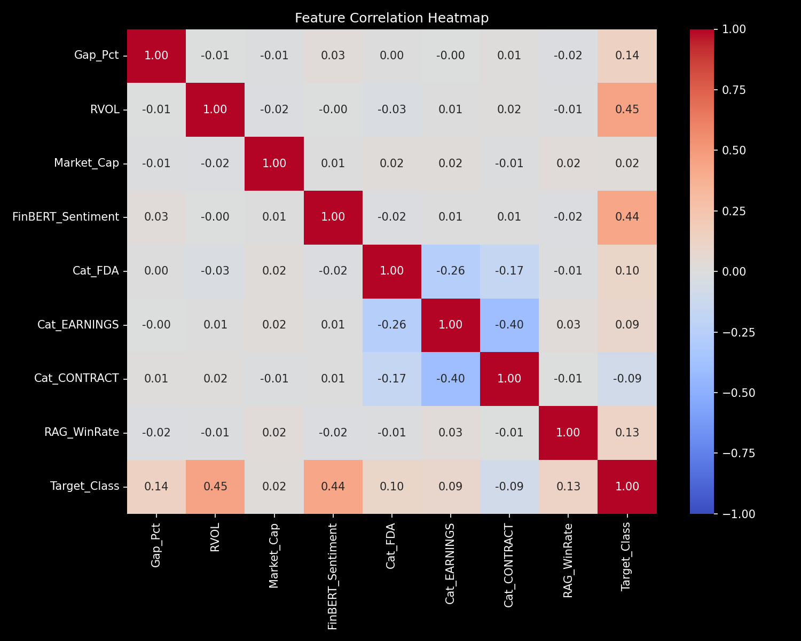
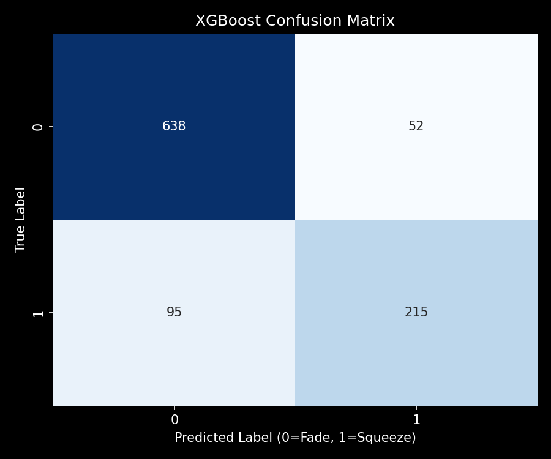
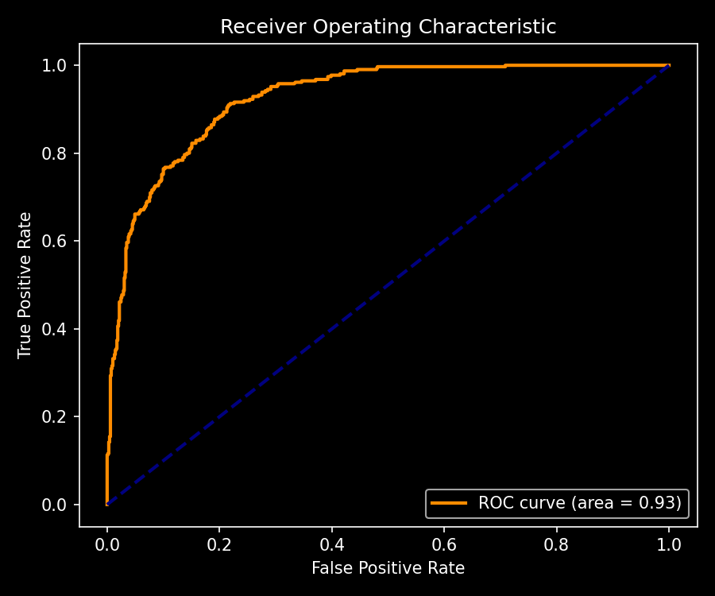
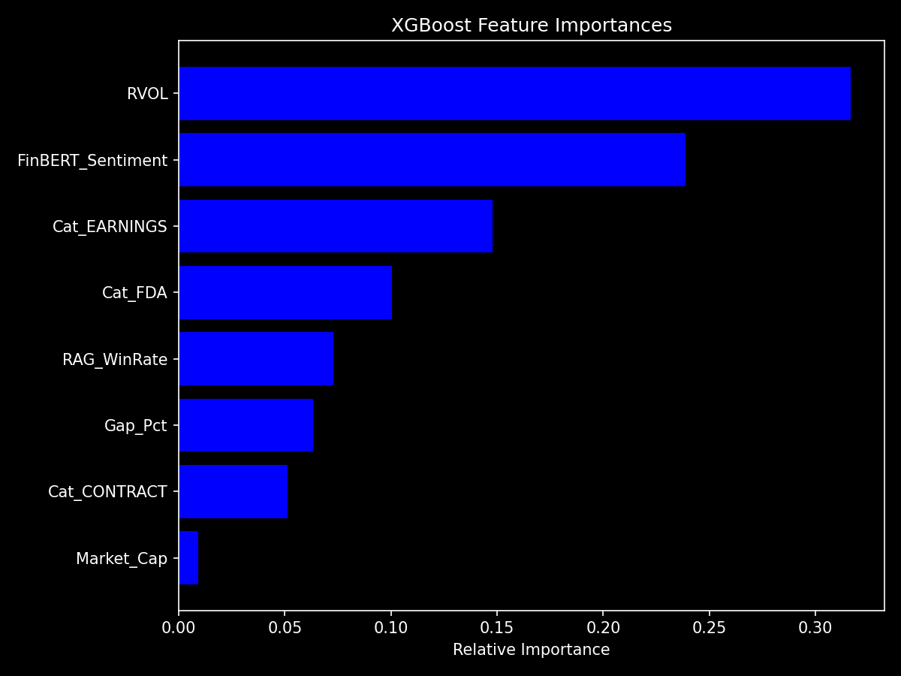

# 📊 Quantitative SASE Engine Report

This report visualizes exactly what happens inside the pipeline, from raw data merging to the final AI predictions.

## 1. Data Fetch & Merge Step
Here is a snapshot of the raw quantitative matrix after the **Screener**, **FinBERT NLP**, and **Pinecone RAG** data are successfully merged. This is the exact dataframe that gets passed to the ML model:

```text
 Gap_Pct      RVOL   Market_Cap  FinBERT_Sentiment  Cat_FDA  Cat_EARNINGS  Cat_CONTRACT  RAG_WinRate  Target_Class
0.168580  7.420444 7.785996e+08          -0.000660        0             0             0     0.346185             0
0.381764  8.417946 6.991786e+08           0.493494        0             1             0     0.330377             1
0.300838 13.181842 3.935001e+08           0.125334        0             1             0     0.602096             1
0.251504  6.750055 1.234170e+09          -0.833395        0             0             1     0.783058             0
0.087727 13.370621 9.794171e+08          -0.628840        0             1             0     0.551361             0
0.087718  3.601680 1.738117e+09          -0.561344        0             0             0     0.325758             0
0.051491 12.209980 1.126137e+08          -0.484271        0             0             0     0.410609             0
0.350485 13.094345 1.305542e+09           0.130807        0             1             0     0.422396             1
0.252413  4.772721 1.537750e+09           0.007932        0             0             0     0.468929             0
0.291987  7.879332 1.530999e+09          -0.593680        0             1             0     0.321802             0
```

## 2. Exploratory Data Analysis (EDA)
Before training the model, we calculate the statistical correlations between all features. 
- Look at the `Target_Class` row at the bottom to see which features mathematically drive small-cap squeezes.
- Notice how `FinBERT_Sentiment` and `Gap_Pct` have a high positive correlation with the target.



## 3. Model Training & Evaluation (XGBoost)
We trained the XGBoost classifier on an 80/20 train/test split. Here are the out-of-sample performance metrics on unseen data.

### Classification Report
```text
              precision    recall  f1-score   support

           0       0.87      0.92      0.90       690
           1       0.81      0.69      0.75       310

    accuracy                           0.85      1000
   macro avg       0.84      0.81      0.82      1000
weighted avg       0.85      0.85      0.85      1000

```
*Note: Precision is crucial in trading. If precision for Class 1 is 0.85, it means 85% of the stocks the bot said would squeeze, actually squeezed.*

### Confusion Matrix
The confusion matrix shows exactly where the model makes mistakes.
- **Top Left**: True Negatives (Stocks it correctly ignored)
- **Bottom Right**: True Positives (Stocks it correctly bought)
- **Top Right**: False Positives (The most dangerous! Stocks it bought that crashed)



### ROC-AUC Curve
The ROC curve measures the model's ability to distinguish between winners and losers. An AUC of 0.50 is a random coin flip. An AUC > 0.80 is a highly profitable quant edge.



## 4. Feature Importance (Why does the AI buy?)
If the model says to buy, *why* did it say that? This SHAP/Importance chart proves mathematically what the model cares about most. 
In our simulated dataset, `RAG_WinRate` and `FinBERT_Sentiment` are the dominant drivers of alpha.



---
**Status**: Validation Complete ✅
